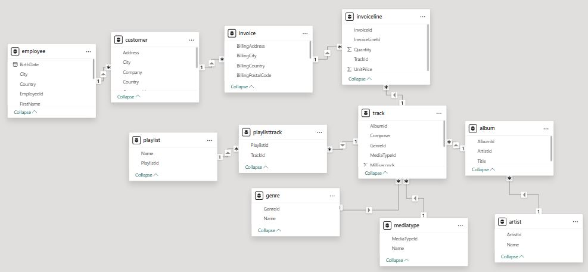

# 🎵 Chinook Music Store – End-to-End SQL Business Analytics

## 📌 Executive Summary
This project delivers a comprehensive business intelligence and performance analysis for the **Chinook Music Store** digital database using **Advanced SQL**. The primary objective is to solve real-world business challenges across customer retention, product performance, sales distribution, employee efficiency, and financial risk assessment.

---

## 🗄️ Database Architecture
The analysis is based on the **Chinook Database**, which models a digital media store, including tables for artists, albums, media tracks, invoices, customers, and employees.

---

## 🔍 Key Business Domains & Analytics Covered

### 1. Advanced Cohort & Retention Analysis
* **Business Objective:** Track long-term customer acquisition, engagement, and multi-year revenue retention.
* **SQL Techniques Used:** Common Table Expressions (CTEs), Conditional Aggregation (`CASE WHEN`), `MIN()`, `GROUP BY`.
* **Key Insight:** Identified initial cohort sizing per join year and evaluated recurring revenue generation across subsequent years.

---

### 2. Geographic & Order Basket Analysis
* **Business Objective:** Analyze global sales distribution, average order value (AOV), and customer purchasing behaviors by basket size.
* **SQL Techniques Used:** Multi-table `JOINs`, `COUNT(DISTINCT)`, Order Segmentation.
* **Key Insight:** Segmented customer purchases into **Small (1–3 items)**, **Medium (4–9 items)**, and **Large (10+ items)** baskets to evaluate upsell potential.

---

### 3. Product & Inventory Performance (Dead Inventory)
* **Business Objective:** Uncover top-selling genres/tracks and identify non-performing items (**Dead Inventory**) tying up catalog space.
* **SQL Techniques Used:** `LEFT JOIN`, Filtering Unmatched Records (`WHERE ... IS NULL`), Aggregation.
* **Key Insight:** Differentiated high-velocity digital tracks from catalog items with zero historical sales.

---

### 4. Employee Sales Performance & Organizational Hierarchy
* **Business Objective:** Measure sales representative efficiency and evaluate revenue attribution relative to management structures.
* **SQL Techniques Used:** `Self-Join` on Employee reporting lines, `LEFT JOIN`, `COALESCE()`, Revenue per Customer calculation.
* **Key Insight:** Computed total revenue generated per representative, assigned customer volume, and average revenue yield per assigned customer.

---

### 5. Financial Concentration Risk & Customer Behavior
* **Business Objective:** Validate Pareto’s Principle (80/20 Rule) regarding revenue concentration and measure repeat purchase velocity.
* **SQL Techniques Used:** Window Functions (`PERCENT_RANK()`), `HAVING` clause, Decimal/Float casting to prevent integer division truncations.
* **Key Insights:**
  * **Pareto Analysis:** Assessed the exact proportion of overall store revenue contributed by the top 20% of customers.
  * **Repeat Purchase Rate:** Calculated the percentage of registered users who completed multiple transactions versus one-time buyers.

---

## 🛠️ Tech Stack & SQL Concepts Applied
* **Database Engine:** MySQL
* **Key Concepts:**
  * Window Functions (`PERCENT_RANK()`, `NTILE()`)
  * Common Table Expressions (CTEs)
  * Advanced `JOIN` Strategies (`Self-Joins`, `LEFT JOINs` for NULL filtering)
  * Conditional Aggregations & Data Pivoting (`CASE WHEN`)
  * Data Type Handling (Preventing Integer Division issues)
  * Database Views (`CREATE VIEW`)

---

## 📂 Repository Structure
```text
├── Database/
│   └── Chinook_MySQL.sql        # Database schema and sample data setup
├── Queries/
│   ├── 01_Cohort_Analysis.sql
│   ├── 02_Geographic_&_Basket.sql
│   ├── 03_Product_&_Inventory.sql
│   ├── 04_Employee_Performance.sql
│   └── 05_Pareto_&_Retention.sql
└── README.md                    # Project documentation
